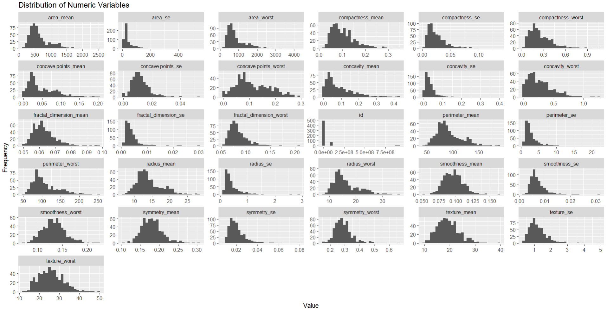
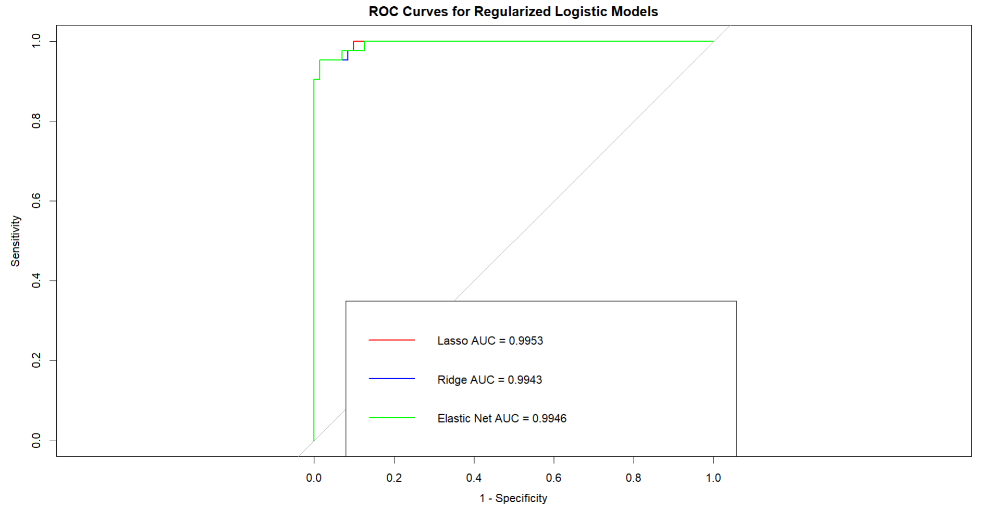
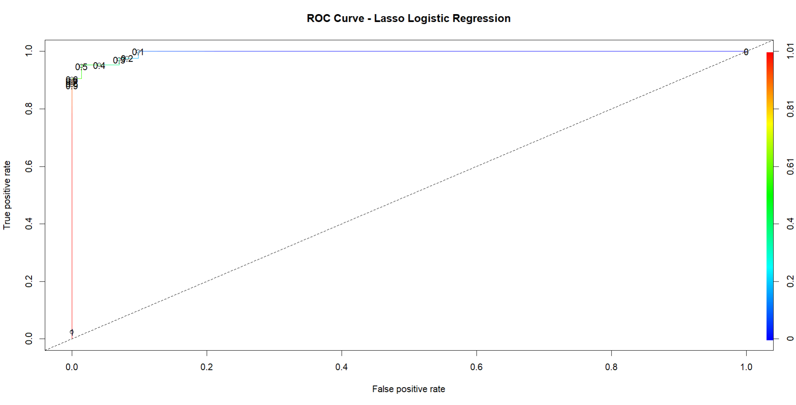

# Breast Cancer Classification using Regularized Logistic Regression

## Key Result

A Lasso logistic regression model achieved **97.6% recall** for malignant tumors while reducing false negatives to **1 case**, demonstrating strong performance for medical classification tasks where missed diagnoses are critical.
## Overview

This project applies logistic regression and its regularized variants (Lasso, Ridge, and Elastic Net) to classify tumors as **malignant (M)** or **benign (B)** using the Breast Cancer Wisconsin (Diagnostic) dataset.

The analysis focuses on:
- handling **multicollinearity**
- comparing **regularized models**
- optimizing classification thresholds to **minimize false negatives**, which is critical in medical diagnosis

---

## Dataset

- Source: Breast Cancer Wisconsin (Diagnostic)
- Observations: **569**
- Features: **30 numeric predictors**
- Target variable: `diagnosis` (M = malignant, B = benign)

### Train/Test Split
- Training set: **456 (80%)**
- Test set: **113 (20%)**
- Stratified sampling was used to preserve class distribution

Test set distribution:
- Benign: 71
- Malignant: 42

---

## Data Preprocessing

- Removed ID column (non-informative)
- Removed column with all missing values
- Converted categorical variables to factors
- Verified no missing values
- Removed duplicate rows
- No manual standardization applied  
- (`glmnet` standardizes predictors internally)

---

## Exploratory Data Analysis

Histograms of all numeric variables were inspected.

Key observations:
- Many variables exhibit **right-skewness**
- No **invalid or impossible values** detected
- Some extreme values present, likely due to skewness rather than true outliers
- Several variables appear **correlated**, suggesting potential multicollinearity



---

## Baseline Logistic Regression

A standard logistic regression model was fitted as a baseline.

### Issues observed:
- Model **did not converge**
- Fitted probabilities were numerically **0 or 1**
- Extremely large coefficients and standard errors
- Most predictors not statistically significant

### Multicollinearity Diagnosis
Variance Inflation Factor (VIF) values were extremely large (up to >300,000), confirming **severe multicollinearity**.

These issues motivated the use of **regularized logistic regression models**.

---

## Regularized Logistic Regression Models

The following models were implemented using `glmnet`:

- **Lasso (L1)**
- **Ridge (L2)**
- **Elastic Net (α = 0.5)**

Hyperparameters were selected using **cross-validation**.

---

## Model Performance Comparison

### Confusion Matrices (Threshold = 0.5)

| Model        | False Negatives | False Positives |
|-------------|----------------|----------------|
| Baseline     | 2              | 7              |
| Lasso        | 3              | 1              |
| Ridge        | 2              | 1              |
| Elastic Net  | 3              | 1              |

---

### AUC Comparison

| Model        | AUC    |
|-------------|--------|
| **Lasso**        | **0.9953** |
| Elastic Net  | 0.9946 |
| Ridge        | 0.9943 |



The ROC curves for Lasso, Ridge, and Elastic Net almost completely overlap, indicating very similar classification performance across models.

All models achieve near-perfect discrimination, with AUC values close to 1.0. The small differences between curves are negligible in practice, suggesting that model choice should be based on other factors such as interpretability and threshold behavior rather than AUC alone.

---
## Model Selection
Although all regularized models (Lasso, Ridge, and Elastic Net) achieved very similar performance (AUC ≈ 0.995), **Lasso was selected as the final model** for the following reasons:

- **Highest AUC** (0.9953), although only marginally better than others  
- **Built-in feature selection**, producing a sparse and more interpretable model  
- **Effective threshold tuning**, allowing significant reduction in false negatives  
- Strong overall balance between sensitivity and specificity  

While Ridge achieved slightly fewer false negatives at the default threshold (0.5), Lasso provided greater flexibility for threshold adjustment and interpretability.

Therefore, Lasso was chosen as the most practical and effective model for this classification task.

## Threshold Optimization (Lasso)

Because **false negatives (missed cancer cases)** are critical, the classification threshold was reduced from 0.5 to **0.25**.

This improves sensitivity (recall) at the cost of slightly more false positives.



---

## Final Model Performance (Lasso, Threshold = 0.25)

Confusion Matrix:

| Actual \ Predicted | 0 | 1 |
|------------------|---|---|
| 0 (Benign)       | 66 | 5 |
| 1 (Malignant)    | 1  | 41 |

### Metrics

- Accuracy: **0.947**
- Precision: **0.891**
- Recall (Sensitivity): **0.976**
- Specificity: **0.930**
- F1 Score: **0.932**
- Balanced Accuracy: **0.953**
- False Positive Rate: **0.070**

### Key Result
- False negatives reduced to **1 case**, which is critical for medical safety

---

## Model Interpretation (Lasso)

Lasso performs **feature selection** by shrinking some coefficients to zero.

### Notable predictors (non-zero coefficients):
- Strong positive association:
  - `concave points_mean`
  - `smoothness_se`
  - `concave points_worst`
- Strong negative association:
  - `fractal_dimension_mean`
  - `fractal_dimension_se`

Positive coefficients increase the likelihood of a tumor being classified as malignant, while negative coefficients decrease this likelihood.

---

## Conclusion

- Baseline logistic regression was **unstable** due to multicollinearity
- Regularized models (Lasso, Ridge, Elastic Net) all performed **extremely well**
- Performance differences between models were **minimal (AUC ~0.995)**
- **Lasso was selected** because:
  - highest AUC (slightly)
  - built-in feature selection
  - effective threshold tuning

By adjusting the classification threshold:
- false negatives were minimized (**critical in cancer detection**)
- overall model performance remained high

---

## Limitations

- Only a single train/test split was used (no repeated cross-validation)
- Elastic Net mixing parameter (α) was not tuned
- No external validation dataset
- Model calibration was not evaluated

---

## Future Improvements

- Tune Elastic Net mixing parameter (α)
- Perform repeated cross-validation for more robust evaluation
- Evaluate model calibration
- Test on external datasets

---

## How to Run

```r
# install required packages
install.packages(c("tidyverse", "caTools", "glmnet", "ROCR", "pROC", "car", "rio", "here"))

# run script
source("scripts/logistic_regression_models.R")
